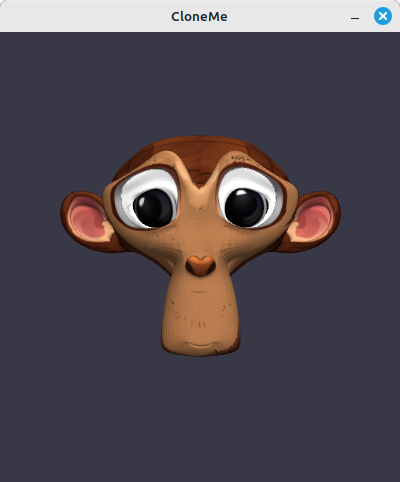
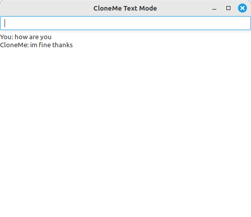

## About Cloneme




Cloneme is a research and learning project that explores how **voice recognition** can drive **real‑time mesh animation**.  
Built in C with OpenGL, it integrates the [Vosk speech recognition engine](https://alphacephei.com/vosk/) to capture spoken 
input and translate it into dynamic facial expressions and character responses.  

The project is designed as a modular system: audio capture, memory management, and response generation are separated into 
reusable components. This makes it easier to extend the framework with new features such as eye movement, emotion mapping, 
or additional voice models.  

## Why C?

This project is intentionally written in **C**.  
I chose C because it gives me direct, low‑level control over memory, performance, and hardware interaction. Unlike higher‑level languages, C keeps me close to the metal — every pointer, every allocation, every structure is explicit.  

For graphics and animation work, this matters:
- **Efficiency**: C produces fast, predictable binaries with minimal overhead.  
- **Portability**: C code can be compiled across platforms with very few changes.  
- **Transparency**: There’s no hidden runtime; I can see exactly how data flows.  
- **Learning value**: Working in C forces me to understand the fundamentals of rendering, mesh manipulation, and system calls.  

This project isn’t just about building features — it’s about exploring the raw power of C as a language for graphics 
programming and animation systems.


Cloneme is not a finished product but a **sandbox for experimentation** — a place to test ideas about combining speech, 
animation, and modular programming into a cohesive workflow.

# Cloneme

Cloneme is an experimental project focused on **voice recognition, mesh animation, and modular system design**.  
It combines C/OpenGL programming with speech-to-text (via Vosk) and facial animation routines to explore how audio input can drive real-time character expressions.

## Features
- 🎙️ **Voice recognition** using Vosk API  
- 🧩 **Modular codebase** with components for memory, mic input, and response handling  
- 🖼️ **Mesh and facial animation** (OBJ/MTL assets included)  
- 📦 **Reusable workflow** with annotated source files and makefile for easy compilation  
- 🔑 **SSH/GitHub ready** with version control and asset management

## Project Structure
- `cloneme.c` / `clone.c` — core program logic  
- `voice.c`, `respond.c`, `mic.c` — audio capture and response modules  
- `memory.c` — memory management routines  
- `monkey.obj`, `monkey.mtl` — sample 3D assets for animation  
- `vosk-model-*` — speech recognition models  

## Getting Started
1. Clone the repository:
   ```bash
   git clone git@github.com:netcorus69/cloneme.git
   cd cloneme
Build the project: make
Run with a test audio file:./cloneme test.wav
